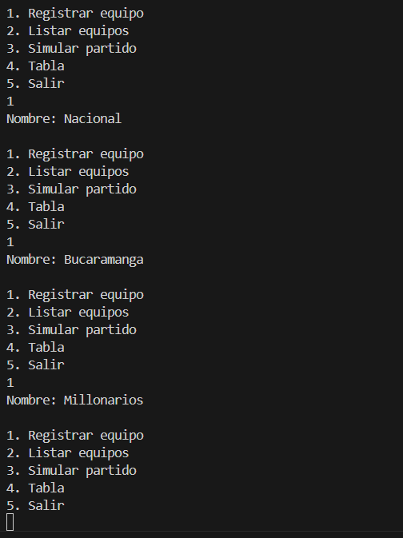
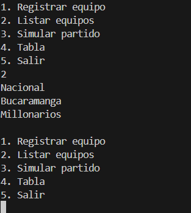
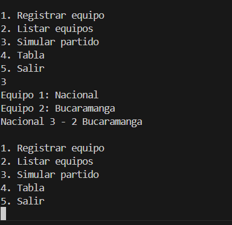
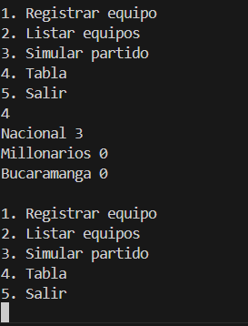

# ⚽ Simulador Liga BetPlay - Consola C#

## Descripción

Este proyecto es una aplicación de consola desarrollada en **C#** que simula el funcionamiento básico de la Liga BetPlay.

Permite registrar equipos, simular partidos, actualizar estadísticas automáticamente y mostrar la tabla de posiciones usando **Programación Orientada a Objeto**.

Es un proyecto pensado para practicar lógica de programación y organización de código.

---

## Funcionalidades

* Registrar equipos
* Listar equipos
* Simular partidos con resultados aleatorios
* Actualizar estadísticas automáticamente
* Mostrar tabla de posiciones ordenada
* Consultas con LINQ:

  * Líder del torneo
  * Top 3
  * Equipos invictos
  * Equipos sin victorias
  * Equipos con más goles
  * Mejor defensa
  * Promedios y totales

---

## Uso del sistema

El programa funciona con un menú en consola:

```
1. Registrar equipo
2. Listar equipos
3. Simular partido
4. Ver tabla
5. Salir
```

Solo debes ingresar el número de la opción y seguir las instrucciones.

---

## Lógica del sistema

* Cada equipo guarda sus estadísticas:

  * PJ, PG, PE, PP
  * GF, GC
  * TP (puntos)

* Los puntos se calculan así:

  * Victoria = 3 puntos
  * Empate = 1 punto
  * Derrota = 0 puntos

* La tabla se ordena por:

  1. Puntos
  2. Diferencia de gol
  3. Goles a favor
  4. Nombre

---

## Capturas

### Crear equipos



### Listado de equipos



### Simulación de partidos



### Tabla de posiciones



---


